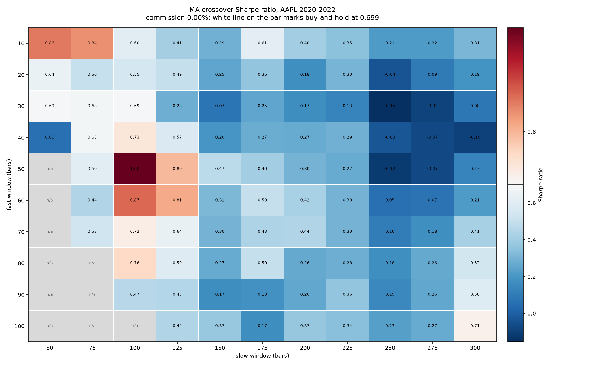
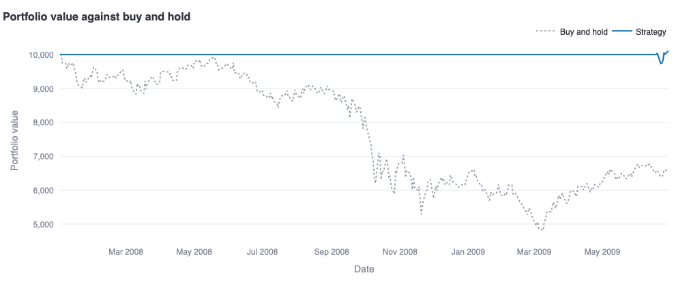
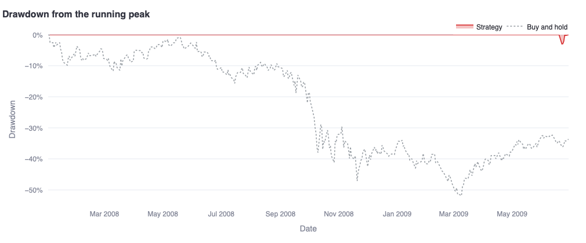
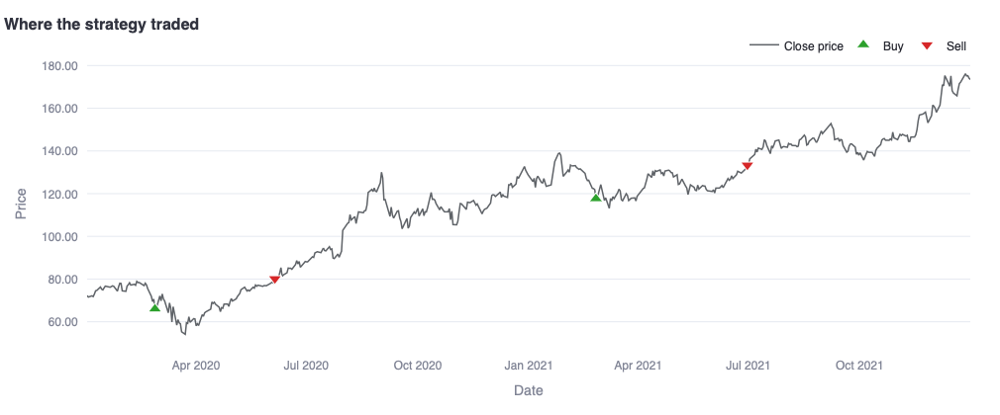
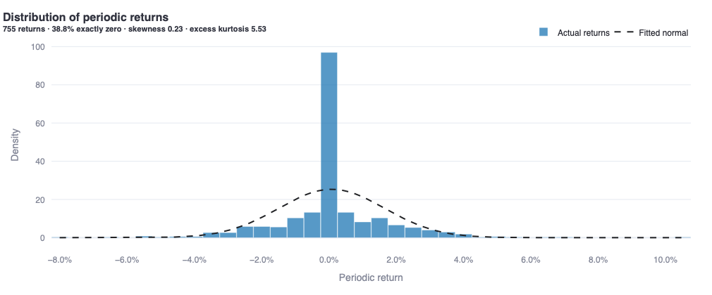
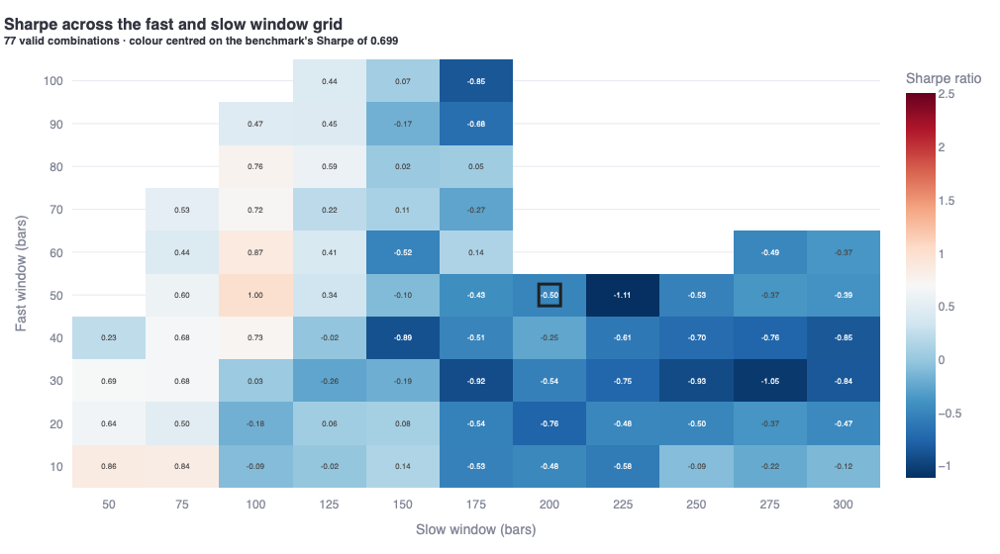

# Trading Strategy Backtester

A modular Python backtesting and risk-analytics engine for systematic trading strategies.

**[Live demo](https://trading-strategy-backtester-tzdyttuawvpyppqjy3adxr.streamlit.app)**. Test any ticker and period yourself. Nothing to install.

> Built a modular Python backtesting engine to evaluate trend-following, momentum, and mean-reversion strategies, incorporating portfolio simulation, market frictions, benchmark comparison, risk-adjusted performance analysis, and walk-forward validation.

## 1. Research question

Can classic technical strategies (trend-following, mean reversion, time-series momentum) produce durable risk-adjusted returns after realistic transaction costs?

A "no" is a valid answer. The point of the project is a framework that can give that answer without cheating: no look-ahead, costs that actually hit the book, parameters chosen only on data a trader would have had, and a report that says when a number is describing cash rather than a strategy.

The findings below are one application of that framework, mostly on AAPL and SPY, over a handful of windows. The [live demo](https://trading-strategy-backtester-tzdyttuawvpyppqjy3adxr.streamlit.app) runs the same engine on any Yahoo-listed ticker and any dates from 2000 through today. If a result here depends on the sample, you can change the sample.

## 2. Key findings

These strategies are not uniformly worse than buy-and-hold. Their ranking changes with the market they are dropped into. What does not change is the last step: after costs and out-of-sample checks, none of them shows a durable risk-adjusted edge.

### Bear market: the exit door works (2008 crisis)

1 January 2008 to 30 June 2009, 377 trading days. Buy-and-hold on SPY returned −34.19% with a max drawdown of −51.87%. On AAPL it returned −26.90% with a max drawdown of −59.88%.

The two trend-following rules spent almost the entire window in cash:

| | Return | vs B&H | Sharpe vs B&H | Max DD | Exposure |
|---|---:|---:|---:|---:|---:|
| **SPY, buy-and-hold** | −34.19% |  |  | −51.87% | fully invested |
| SPY, MA crossover | +0.27% | +34.46 pp | +0.594 | −3.00% | 2.4% |
| SPY, Momentum | −1.26% | +32.93 pp | +0.338 | −5.57% | 5.3% |
| **AAPL, buy-and-hold** | −26.90% |  |  | −59.88% | fully invested |
| AAPL, MA crossover | +19.20% | +46.10 pp | +1.444 | −7.37% | 9.0% |
| AAPL, Momentum | −11.98% | +14.92 pp | −0.070 | −41.30% | 27.6% |

Completed round-trips on SPY: zero. The return gap is avoided loss, not trading profit. RSI on SPY stayed 96% invested and barely moved the drawdown (−51.48% vs −51.87%). Mean reversion is not an exit rule, and 2008 does not pretend otherwise.

This is the result a one-period, post-2009 study cannot see. Sitting out a crash is what these rules are sold on. On this window, they did it.

### Sideways market: mean reversion's home (2015-16)

2 January 2015 to 30 December 2016, 504 days. SPY rose 13.44% with a −13.02% drawdown. Choppy, little net progress.

RSI mean reversion was the only rule that beat the index: +22.74% (+9.30 pp), Sharpe 1.136 vs 0.513, drawdown −5.61%. MA lost 13.96 pp and Momentum lost 12.53 pp; both drew down about as deep as the asset. That is the textbook split. Oscillators are built for ranges. Moving averages get chopped in them.

On AAPL the same window is messier. Nobody beat the stock on return. MA kept a shallower drawdown (−10.15% vs −30.44%) and a higher Sharpe, mostly by being invested 17% of the time.

### Bull and mixed windows: the other side of the trade

2017, a quiet grind. SPY +20.78% (Sharpe 2.866, max DD −2.61%). AAPL +48.04% (Sharpe 2.331, max DD −8.86%). Nobody beat buy-and-hold on return or on Sharpe. RSI never fired (0% exposure, Sharpe undefined). MA's 200-day average exists for only the last fifth of a 251-bar year, so most of that "strategy" is warm-up.

The shallower drawdowns in 2017 (MA −1.03% vs SPY −2.61%, RSI at 0%) are cash sitting out a rising market. That is opportunity cost. It is not the 2008 result in a smaller font.

2020-22 is the project's default window: COVID crash, rally, then decline. 756 bars, 2 January 2020 to 30 December 2022.

On AAPL, buy-and-hold returned +76.63% (Sharpe 0.699, max DD −31.43%). Every strategy lost on return: Momentum −16.15 pp, RSI −46.86 pp, MA −63.53 pp. Momentum kept a thin Sharpe lead (+0.058).

On SPY over the same dates the ranking flips. Buy-and-hold returned +23.49% (Sharpe 0.407, max DD −33.72%). MA returned +27.57% (+4.08 pp), Sharpe 0.836 (+0.429), drawdown −12.87%. Momentum also beat the index on return and Sharpe. Judging the same rules on AAPL alone, which is what this repo did for most of its life, understates them. AAPL in 2020-22 is a strong bull with one name. SPY is closer to the market the hypothesis is about.

### The edge does not travel

Three checks, all on AAPL unless noted.

**Costs.** At zero friction, Momentum's Sharpe on AAPL 2020-22 is 0.757 against buy-and-hold 0.699. A 0.10% commission leaves the gap at +0.053; the break-even commission on that sample is 1.08% per trade. The table barely moves because the rule traded twice in three years. That is not a property of momentum. Changing only the review frequency, from every 21 bars to every 5, drops Sharpe to 0.410 at zero cost, below the uncharged benchmark. The lead is a property of that frequency. Costs are not what remove it.

MA and RSI have no Sharpe lead to lose on this window, at any cost.

**Parameter sweep.** A grid of fast × slow windows for the MA crossover on AAPL 2020-22 produces an isolated Sharpe peak, not a wide plateau. Neighbours of the best cell fall off. The conventional 50/200 setting loses to buy-and-hold on the same data. A rule that had found something real about prices would work in a neighbourhood of settings. A spike on one cell is a fit to this sample.



**Walk-forward.** AAPL, 2015-2023. Each roll optimises the MA grid on 504 in-sample bars (~2 years), then scores that choice on the next 126 bars (~6 months), never seen during selection. Mean in-sample Sharpe 1.435. Mean out-of-sample Sharpe 0.690. The gap, 0.745, is the overfitting penalty: what the search promised on data it had already seen, and did not deliver on the next window. The chosen parameters beat buy-and-hold on Sharpe in about 18% of out-of-sample windows.

### What that adds up to

Classic technical rules trade upside in a rising market for real downside protection when the market falls. Each rule has a window that suits it (RSI in 2015-16, MA and Momentum in 2008, MA on SPY in 2020-22). After transaction costs, a change of review frequency, a change of asset, and an out-of-sample check that does not reuse the optimisation sample, none of them shows a durable risk-adjusted edge. That is what market efficiency looks like from daily public prices, and it is why buying the asset and holding it is hard to beat.

Reproduce the 2008 row in the [live demo](https://trading-strategy-backtester-tzdyttuawvpyppqjy3adxr.streamlit.app): SPY or AAPL, 2008-01-01 to 2009-06-30.

## 3. Methodology

**Data.** Daily OHLCV from Yahoo Finance via `yfinance`, split- and dividend-adjusted (`auto_adjust=True`). Coverage is whatever Yahoo has for that ticker, from its listing through the latest completed session. The project does not add a second date floor. A request that starts before a listing is shortened to the bars that exist; a request with no trading days at all fails with a clear error.

Downloads are cached under `data/cache/` as CSV with `float_precision="round_trip"`. The first call for a `(ticker, start, end)` hits the network; every later call with the same arguments rereads that file and sees bit-identical prices. Yahoo's adjustments drift between downloads, so without the cache a parameter sweep would compare runs on slightly different histories. The cache directory is gitignored.

`start` is inclusive, `end` is exclusive (Yahoo's convention).

**Backtest model.** The engine walks the history one bar at a time. The signal on bar T may use prices through T and nothing later. Fills are at that bar's close. The book is all-in or all-out: one position, long or flat, never short, never sized. Those are simplifications. A more conservative fill would wait for the next open. They are applied uniformly, so comparisons between rules stay fair even if the absolute levels are optimistic.

**Strategies.** Three rules, all subclasses of `BaseStrategy`, all emitting `BUY` / `SELL` / `HOLD` on transitions:

- Moving-average crossover (fast 50, slow 200). Trend-following. The library default waits for a golden cross inside the window (`enter_on_existing_trend=False`). Comparison and regime scripts set it to `True` so the rule can enter a trend that is already in place, matching how Momentum is phrased.
- RSI mean reversion (Wilder, period 14, 30/70). Buys on a cross down through oversold, sells on a cross up through overbought.
- Time-series momentum (lookback 126, review every 21 bars). Invested while the asset's own trailing return is positive, flat when it is not. This is the Moskowitz, Ooi and Pedersen (2012) construction: one asset, its own past return. It is not Jegadeesh and Titman (1993) cross-sectional ranking, which needs a universe.

**Costs.** Proportional commission, half-spread, and slippage, charged by the `Broker` on every fill. Share count on a buy is recomputed from the effective price and the cash left after commission, so a costly buy cannot overdraw the book. Defaults are zero, so older results stay bit-identical when costs are left unset.

Buy-and-hold is shown uncharged. A real holder pays to get in and to get out. Leaving the benchmark frictionless keeps it a fixed line across cost scenarios. Every reported gap is therefore slightly kinder to the strategy than a fully charged comparison would be. A tie is a loss.

**Analytics.** One report, grouped:

- Return: total, annualized (the exponent is *n*−1 periods, not *n*).
- Risk: exposure (fraction of bars with a position), volatility, max drawdown and its duration.
- Risk-adjusted: Sharpe, Sortino, Calmar. Sortino uses target semi-deviation about the risk-free rate, not the standard deviation of the negative returns only. Constant losses then have a defined Sortino; they would not under the other definition.
- Distribution: skewness, excess kurtosis, Jarque-Bera.
- Tail risk: historical VaR, parametric (Gaussian) VaR, CVaR, all per-period. Parametric VaR assumes normality and understates fat tails, which is why the distribution rows sit next to it.
- CAPM: annualized alpha, beta, R², vs the uncharged buy-and-hold of the same asset.
- Trades: completed round-trips, win rate, average win/loss, profit factor. An open final position is excluded. A high win rate can still lose money; that is why the last three columns exist.

Exposure below 25% raises a written caveat. Flat bars are exact zeros. They pull volatility, both VaR figures, skewness, kurtosis, beta and R² toward a description of cash. Drawdown depth is a path extremum, so cash cannot dilute it, but a shallower drawdown than a fully invested benchmark, on nine bars in ten spent in cash, is absence from the market. The 2008 row is that absence doing the job it was hired for. The 2017 row is the same absence wasting a rally. The report does not collapse those two readings into one badge colour.

## 4. Validation

These are rule-based strategies. The language is in-sample / out-of-sample, not train / test.

**Walk-forward.** Optimise on a past window, apply the winner to the next unseen window, roll by the out-of-sample length so scored windows do not overlap. Parameter selection receives only the in-sample slice; the later bars are absent from the call. The out-of-sample run still starts at the in-sample start date, so indicators can warm up and a position can carry forward. That extra history is older than the scored window.

**Parameter heatmaps.** Fast × slow Sharpe grid, colour scale centred on uncharged buy-and-hold. Isolation is measured (neighbour gap, share of cells near the peak, contiguity of the top decile, share of the grid that beats the benchmark), not guessed from the picture.

**No look-ahead.** Checked two ways. Truncation: cutting the history at every possible length leaves signals and engine decisions on the overlapping earlier bars unchanged. Counterfactual: a selection rule that could see the future would pick different parameters; the walk-forward selection cannot, because those bars are not in the function arguments. The suite sweeps every truncation length on several causal strategies. A one-bar shift that lined up at a few hand-picked cuts would still fail that sweep.

## 5. Architecture

```
data/            load, clean, cache  (yfinance lives here and nowhere else)
engine/          Portfolio, Broker, Backtester
strategies/      BaseStrategy and the three rules
analytics/       metrics, risk, trade stats, unified report, sweep primitives
visualization/   Plotly figures; no Streamlit
app.py           the dashboard; the only file that imports streamlit
constants.py     BUY / SELL / HOLD and TRADING_DAYS_PER_YEAR
```

The engine never imports a strategy package, and strategies never import the engine. Both read the signal vocabulary from a root-level `constants.py`, so neither side looks like a dependency of the other. `app.py` builds a config object and calls the same functions the CLI scripts call. If a number on the dashboard cannot be reproduced with `run_comparison.py`, that is a bug in the wiring.

`analytics/validation.py` holds the sweep and robustness primitives without matplotlib. `run_parameter_sweep.py` plots them; the dashboard imports the same functions and draws Plotly. That split is why opening the app does not pull in a plotting library the UI does not use.

**Tests.** 452 pytest tests (`pip install -r requirements-dev.txt && pytest`). What they actually pin down:

- Portfolio arithmetic against hand-checked cash and share counts; the broker cannot overdraw on a costly `buy_all`.
- A buy-and-hold-equivalent strategy matches the analytic benchmark to a 0.0 difference.
- No-look-ahead, swept over every truncation length, for the engine and for all three strategies.
- Wilder RSI against the published StockCharts reference values, bit for bit on the shared sample.
- Degenerate series (empty, one point, zero volatility, no trades) return NaN rather than raising, so a sweep cell cannot crash the grid.
- Sortino's target semi-deviation, CVaR's inclusion of ties on the threshold, Sharpe's relative near-zero-deviation guard.
- Dashboard failures (unknown ticker, dropped connection, rate limit) render as banners, not tracebacks. A programming error still surfaces as a traceback.

Several of those were found by mutating a passing formula and watching the suite fail. A test that cannot catch its own bug is not counted as coverage.

**Reproducibility.** Cached prices are bit-exact across runs. Given the same cache file and the same arguments, `Backtester.run()` is deterministic. There is no RNG in the engine or the strategies.

## 6. The dashboard

Streamlit app, local or [hosted](https://trading-strategy-backtester-tzdyttuawvpyppqjy3adxr.streamlit.app).

- Ticker: 18 named presets (AAPL, MSFT, GOOGL, AMZN, NVDA, META, TSLA, JPM, V, JNJ, UNH, KO, PG, WMT, XOM, CAT, SPY, QQQ) plus a Custom field for any Yahoo symbol.
- Dates: 2000-01-01 through today. Defaults 2020-01-01 and 2023-01-01. Start must precede end. A ticker listed after the start date runs on the bars it actually has; the header prints that range and notes the request.
- Strategy parameters change with the selected rule. Invalid MA or RSI combinations are unreachable from the sliders.
- Commission, spread, and slippage as percentages, default 0. A caption states that buy-and-hold is uncharged.
- After a run: full performance table, equity vs benchmark, drawdown, trade markers on price, returns histogram against a fitted normal. For MA, an optional Sharpe heatmap of the fast × slow grid, with the selected cell marked. The sweep is behind a button and cached; it is not free.
- Unknown tickers, empty ranges, histories shorter than 60 bars, and network or rate-limit failures show a banner. They do not dump a traceback.

The 2008 numbers in section 2 were produced by this engine. Set SPY, 2008-01-01, 2009-06-30, MA or Momentum, costs at zero, and press Run.











## 7. Limitations

Results depend on the asset and the window. The regime study is that dependence, measured, not a footnote. A different decade or a different name can move a row. That is expected, and it is why the demo exists.

Daily bars and same-bar close fills ignore overnight gaps, next-open slippage, and any delay between a close signal and a tradable price. All-in / all-out ignores position sizing. There is one asset at a time; there is no portfolio construction.

The benchmark pays no costs. Gaps vs buy-and-hold are slightly generous to the strategies.

Cash-heavy windows distort averaged risk and distribution statistics. The report warns when exposure is below 25%. Read those rows as a description of cash unless you are specifically asking whether the rule was out of the market (2008: yes; 2017: also yes, and that is the problem).

These are well-known rules on free daily data. Live trading edges, where they exist, come from better data, faster execution, and constraints these models do not have. This is a research engine for asking a clean question. It is not a trading system, and it will not place an order.

## 8. How to run

The [live demo](https://trading-strategy-backtester-tzdyttuawvpyppqjy3adxr.streamlit.app) needs nothing installed.

Locally, Python 3.10+ (developed on 3.12):

```bash
python3 -m venv venv
source venv/bin/activate          # Windows: venv\Scripts\activate
pip install -r requirements.txt
```

Analysis scripts (each prints a self-contained report; data is cached after the first download):

```bash
python run_comparison.py          # three strategies vs buy-and-hold, AAPL 2020-22
python run_cost_scenarios.py      # commission sweep and break-even
python run_parameter_sweep.py     # MA Sharpe heatmap + isolation read
python run_walk_forward.py        # in-sample vs out-of-sample, AAPL 2015-23
python run_regime_study.py        # 2008 / 2015-16 / 2017 / 2020-22 × SPY and AAPL
```

Dashboard:

```bash
streamlit run app.py
```

Tests:

```bash
pip install -r requirements-dev.txt
pytest
```
